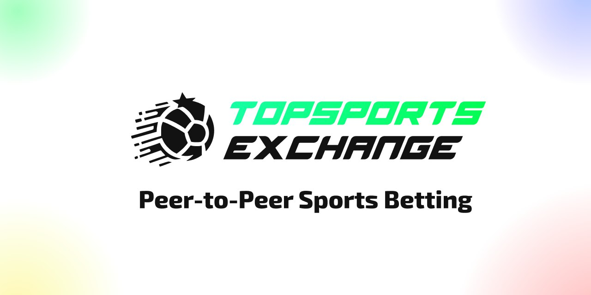
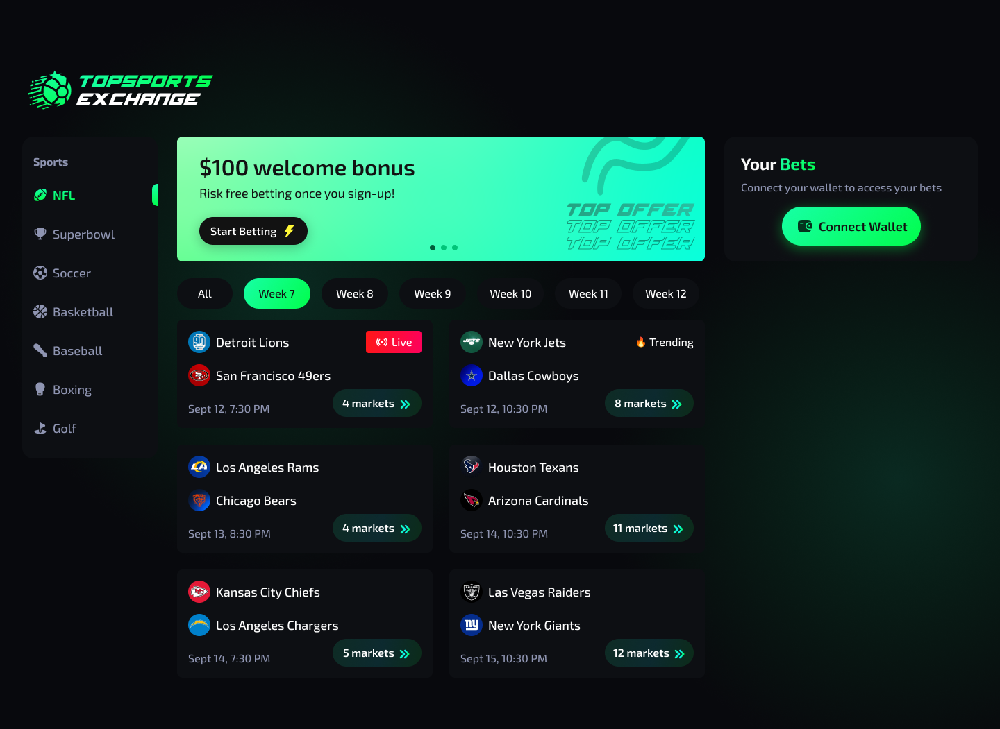
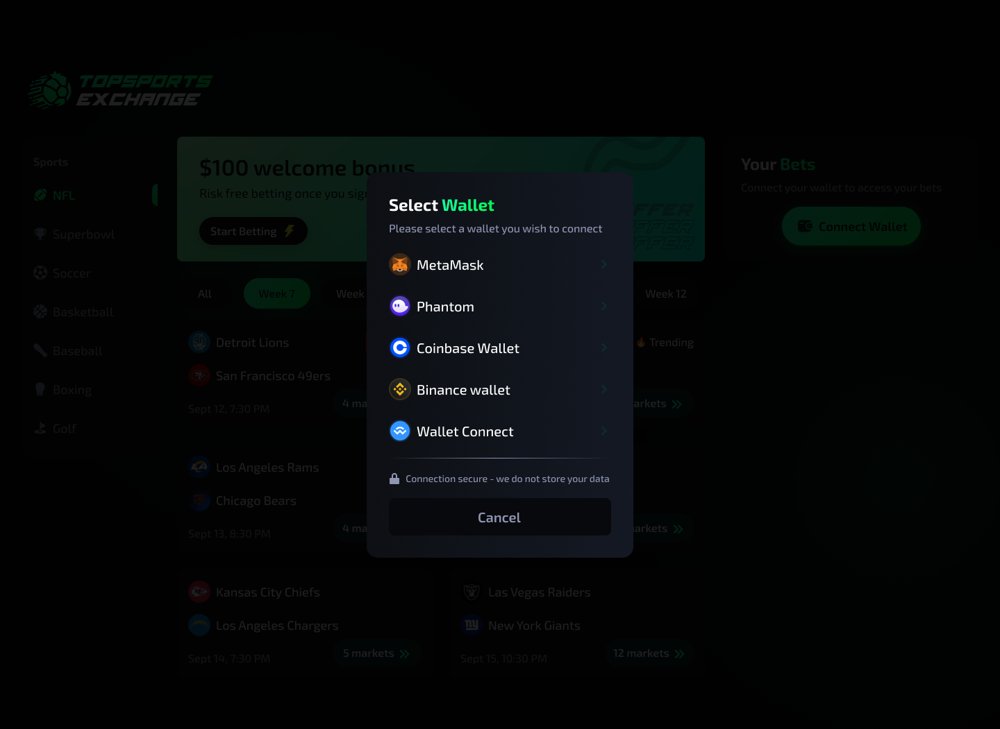
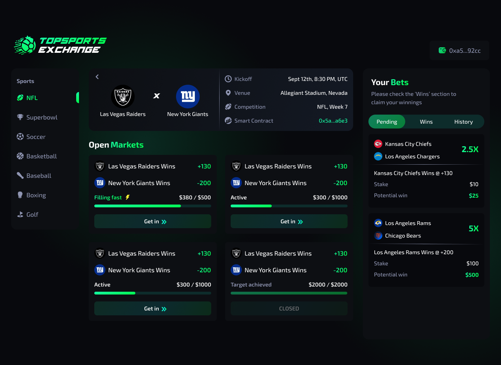
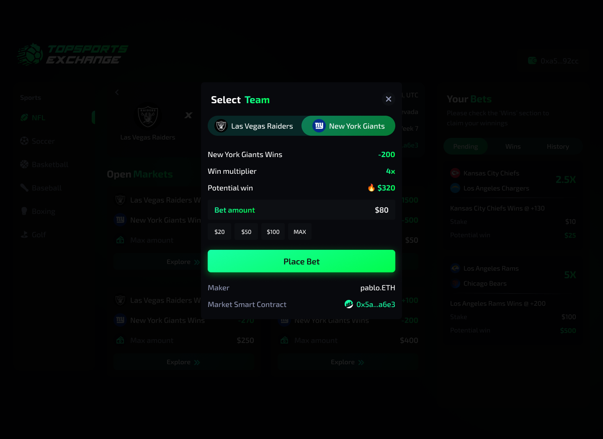
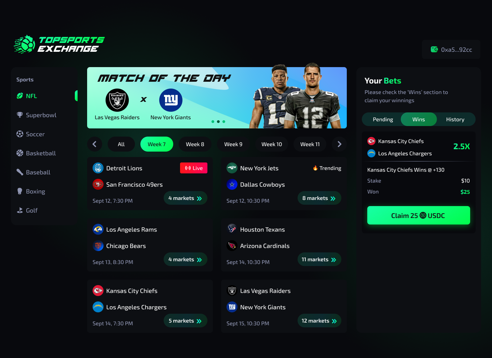
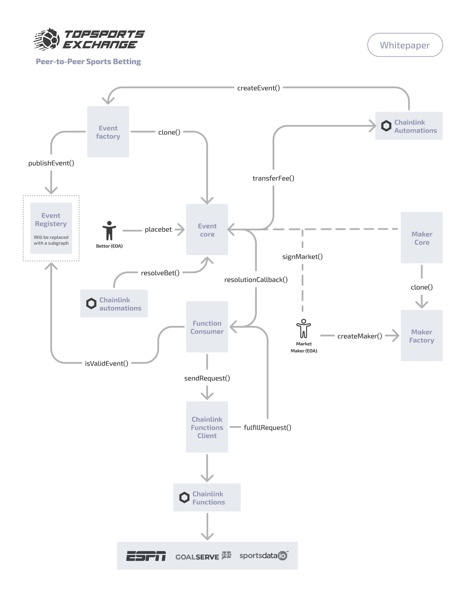

  
  

# Table of Contents

1. [Introduction](#introduction)
2. [Quickstart](#quickstart)
3. [Technical specifications](#technical-specifications)
4. [Technical stack](#technical-stack)
5. [Proof of concept](#proof-of-concept)
6. [Deployments](#deployments)
7. [Frequently Asked Questions](#frequently-asked-questions)
8. [The Team](#the-team)

# Introduction

## Overview

**Topsports.Exchange** is a cutting-edge peer-to-peer betting exchange that introduces innovation to the online sports betting landscape. This platform leverages blockchain technology to enhance the betting experience, offering users the best odds and maximizing potential returns through a trustless and decentralized application. Market makers can propose odds and liquidity, while bettors can choose the most favorable odds and wager against these proposed markets.

Topsports.Exchange envisions making it easy for bettors to access the best odds for a particular game. The platform facilitates the seamless proposal, update, or closure of markets, positioning itself as a bridge for traditional web2 betting into the web3 era.

During the Constellation Hackathon, we are extending our support to the regular season of the American Football NFL, specifically focusing on events and markets for weeks 14 and 15, coinciding with the judging period of the hackathon. Our future plans include expanding our support to encompass a broader range of sports such as basketball, baseball, hockey, and boxing, along with extending our coverage to include more minor leagues.

## What problems are we solving?

**Topsports.Exchange** resolves several challenges in the online sports betting industry:

-   Difficulty for amateur bettors to determine if bookmaker odds are fair.
-   Lack of truly trustless and permissionless online sports betting platforms.
-   Inefficiencies in traditional web2 betting apps, such as unclear risk/reward calculations, centralized structures, lengthy withdrawal processes, and barriers to entry for aspiring bookmakers.

## How are we addressing these issues?

### Fairness

Odds fairness is addressed by Topsports.Exchange through a unique approach. By connecting market makers and bettors, the platform encourages market makers to offer more competitive odds, naturally leading bettors to markets with higher expected returns. The app ensures that odds are presented comprehensively and transparently.

### Non-Custodial

Unlike traditional platforms, Topsports.Exchange does not hold user funds. Funds are transferred and locked in the event contract when a bet is placed, and they are released immediately upon the settlement of the sports game. This eliminates the need for lengthy withdrawal processes and KYC requirements.

### Trustless

Topsports.Exchange avoids relying on DAOs for settlement. Instead, it utilizes data feeds from professional sports data API providers, ensuring trust-minimized outcomes. Chainlink Functions enable smart contracts to access decentralized compute infrastructure, fetching off-chain data and resolving events securely.

### Permissionless

Topsports.Exchange operates as an exchange without special permissions. All deployed contracts are ownerless, and future event smart contracts will be automatically deployed in a decentralized manner with Chainlink Automation.

### Market-Making

A notable feature of Topsports.Exchange is its permissionless market-making. Anyone can become a market maker, proposing markets to bettors. Market makers retain ownership of their liquidity until a bet is taken, allowing them to create, update, or delete markets without incurring gas fees.

## Who constitutes our user base?

The application appeals to a diverse range of individuals, including:

-   Novice bettors who find pleasure in placing straightforward and secure moneyline crypto bets through a user-friendly platform.
-   Experienced and professional bettors in search of optimal odds to maximize their +EV (expected value) or explore arbitrage opportunities.
-   Bettors interested in taking on the role of the bookmaker, publishing their own odds, and accepting wagers from other users.
-   Professional bookmakers aiming to engage with customers in the web3 space, utilizing a flexible and versatile platform with robust integration APIs to publish their markets.

# Quickstart

1. Click the "Connect Wallet" button on main page

2. Select your wallet in the list

3. Select an event and pick a market

4. Place your bet

5. Claim your winnings!

# Technical specifications

## How Chainlink revolutionizes online sports betting

In **Topsports.Exchange**, **Chainlink** plays a pivotal role in addressing a fundamental challenge within the traditional betting industry – the inherent trust issues associated with outcomes determined by bookmakers. Even on existing blockchain-based betting platforms, resolution of events typically relies on decentralized autonomous organizations (DAOs), which can be compromised when a single address or a consortium of addresses holds substantial voting power. **Topsports.Exchange** leverages **Chainlink Functions** to establish a trustless environment. By delegating the outcome determination of events to external professional data providers and utilizing **Chainlink Functions** to retrieve this data on-chain, **Topsports.Exchange** introduces sports markets that are externally resolved, eliminating any permissions tied to the platform. This unique approach empowers anyone to initiate the resolution of an event.

Furthermore, **Topsports.Exchange** integrates **Chainlink Automations** to streamline the automatic creation of smart contracts for new events as soon as they are published by sports data providers. Upon resolution of an event, a small fee, collected from the winnings, can be directed to the **Chainlink Automation** contract, facilitating the creation of new events without the need for specific permissions. Chainlink Automations also play a crucial role in resolving off-chain events after their completion, further enhancing the efficiency and autonomy of **Topsports.Exchange**. This innovative utilization of **Chainlink** products positions **Topsports.Exchange** at the forefront of breakthroughs in the online sports betting industry.

## Architecture overview

## Smart-contracts overview

1. A maker must initiate their MakerCore instance by calling `createInstance()` on the maker factory. For the hackathon, support for this feature in the UI will not be available, and the project team will create a couple of Maker contracts using scripts.

2. The maker must fund their MakerCore instance by either transferring tokens or calling the `deposit()` function on their instance of Maker.

3. A market maker can create markets on available events. Creating a market involves signing a message; no funds are transferred from the Maker instance to the Event instance when creating a market. Similarly, this feature won't be supported in the UI for the hackathon, and markets will be created by the project team using scripts.

4. A market taker can participate in a market by supplying a market maker signature (along with other parameters) to the `placeBet()` function. Upon executing the function, tokens on the Maker contract (the “profit”) and tokens staked by the market takers (the “stake”) are transferred to the event instance smart contract. These funds are locked until the event either resolves or is canceled after the specified deadline.

5. The `resolveEvent()` function is designed to be permissionless and can be called at any time. However, calling the function before the event concludes is discouraged, as it incurs Chainlink Functions fees for a function that may not yield a winner and cannot effectively resolve the event prematurely.

6. Following the event's completion, the ESPN API will be updated with winner data. Invoking the `resolveEvent()` function will retrieve the winner data from ESPN API and write it on-chain. Market makers and market takers can then proceed to claim their winnings for the bets that are resolved in their favor, respectively.

## Market Making with Topsports.Exchange

Topsports.Exchange relies on an intelligent architecture to facilitate efficient market making. Odds in sports betting are dynamic and subject to change due to various factors, such as bookmakers hedging their positions, and external events like injuries or weather conditions influencing the odds as the game approaches. Therefore, it is crucial for market makers to have the ability to adjust their odds responsively.

The platform efficiently supports this process by eliminating the need for market makers to execute and pay transactions on the blockchain to create a market. Instead, market makers sign their market, and it is the market taker who executes the transaction. The market taker can pull funds from the market maker provisioning contract and lock this liquidity, along with their own stake, in the event contract. This approach is highly effective as it allows market makers to push multiple markets on numerous events without the concern of these markets going untaken, thereby avoiding transaction gas costs.

In summary, market making on Topsports.Exchange is devoid of infrastructure costs. The Topsports.Exchange application empowers market makers to control and generate markets on demand and in response to changing conditions.

> Constellation, however, does not currently support the market maker role in its user interface. Nevertheless, the smart-contract internals for market making are implemented, and market takers can utilize markets generated by the Topsports.Exchange team.

## Technical stack

Software:

-   Scale-ETH
-   Hardhat
-   Chainlink Functions
-   Chainlink Automations

Service providers:

-   Supabase
-   Vercel

# Proof of concept

## Avalanche Fuji

Event ID: `401547578`

Chainlink Functions Subscription ID: **658**

Event contract: [https://testnet.snowtrace.io/address/0x9cC5902048cd9111C722F6eD193C23b0537D0200](https://testnet.snowtrace.io/address/0x9cC5902048cd9111C722F6eD193C23b0537D0200)

Game: New England Patriots at Pittsburgh Steelers

Outcome: Steelers win

> Unfortunately, recent modifications in `snowtrace.io` have resulted in the inability to display source code and method names when examining an EIP-1167 instance of a verified implementation. This issue has been reported to the Avalanche development team. It's important to note that this problem does not impact `polygonscan`.

1. An externally owned account (EOA) utilizes the `placeBet()` function to submit a bet using a market signature. Transaction ID: `0x4510d341f99f1cf1cdcea645d847ccb1a06dadb0ed09d18659ecc280a35c1e07`.
2. An EOA initiates the `resolveEvent()` function to trigger the resolution of the event. Transaction ID: `0x97c6d26acb56bb9226acd0072d5a43c031a951e416c3b71b1f5a277a3aabd90b`.
3. Chainlink Functions execute the `resolutionCallback()` function, incorporating an off-chain API response. Transaction ID: `0x6296ca5ee04309aa3c8dd1b77e2b4499577e7eadcd1c49bac8715a60ef53c446`.
4. An EOA invokes the `collect()` function to claim their winnings. Transaction ID: `0x245be756995cce13d0ebc772e6ed2a30ac48d2415f9fa7d6c4b537a2c41b7614`.

## Polygon Mumbai

Event ID: `401547608`

Chainlink Functions Subscription ID: **996**

Event contract: [https://mumbai.polygonscan.com/address/0xe723cE47dc870694fE7792D37B2627BFA8a339c8](https://mumbai.polygonscan.com/address/0xe723cE47dc870694fE7792D37B2627BFA8a339c8)

Game: Kansas City Chiefs at New England Patriots

Outcome: Chiefs wins

# Deployments

## Chainlink Functions Consumers

| Fuji                                                                                                                          | Mumbai                                                                                                                          |
| ----------------------------------------------------------------------------------------------------------------------------- | ------------------------------------------------------------------------------------------------------------------------------- |
| [0x803C225C6037d27Aa4C652548223D996aD5c7CE7](https://testnet.snowtrace.io/address/0x803C225C6037d27Aa4C652548223D996aD5c7CE7) | [0x2599E6667b4ceE2e6f9ae88e83501c0672fb8b58](https://mumbai.polygonscan.com/address/0x2599E6667b4ceE2e6f9ae88e83501c0672fb8b58) |

## Events

| Name                                        | Date                          | Fuji                                                                                             | Mumbai                                                                                             |
| ------------------------------------------- | ----------------------------- | ------------------------------------------------------------------------------------------------ | -------------------------------------------------------------------------------------------------- |
| New England Patriots at Pittsburgh Steelers | Fri, 08 Dec 2023 01:15:00 GMT | [0x9cC5...0200](https://testnet.snowtrace.io/address/0x9cC5902048cd9111C722F6eD193C23b0537D0200) | [0x017D...D05c](https://mumbai.polygonscan.com/address/0x017D7ce35829d8c1611Eb983d5B502a54B17D05c) |
| Tampa Bay Buccaneers at Atlanta Falcons     | Sun, 10 Dec 2023 18:00:00 GMT | [0x8384...671e](https://testnet.snowtrace.io/address/0x8384cc0D1C34b57e83B04Df720975BfDDf7B671e) | [0xC43E...B115](https://mumbai.polygonscan.com/address/0xC43E3eFAeB28Ed757E59ebaDc317bcfD8Ee0B115) |
| Detroit Lions at Chicago Bears              | Sun, 10 Dec 2023 18:00:00 GMT | [0x3c06...2aF7](https://testnet.snowtrace.io/address/0x3c06d1664664322B0ad02EBd02fd4844b4732aF7) | [0x47BB...39B3](https://mumbai.polygonscan.com/address/0x47BBF7ac82AFE7462fC33B1edAAbaB78b05339B3) |
| Indianapolis Colts at Cincinnati Bengals    | Sun, 10 Dec 2023 18:00:00 GMT | [0xf810...1446](https://testnet.snowtrace.io/address/0xf810fDe389c19A3A4F75812A2f32d457DE3b1446) | [0xE4B5...F77F](https://mumbai.polygonscan.com/address/0xE4B574d1361fDaA0BC0140D4f041Fd1136f4F77F) |
| Jacksonville Jaguars at Cleveland Browns    | Sun, 10 Dec 2023 18:00:00 GMT | [0x0c59...b484](https://testnet.snowtrace.io/address/0x0c596B0e3DAe88fe31c1A2F234c7685edA3cb484) | [0xED67...1166](https://mumbai.polygonscan.com/address/0xED67Edbc7c1846BF67103Bc4b21e5223b3B51166) |
| Carolina Panthers at New Orleans Saints     | Sun, 10 Dec 2023 18:00:00 GMT | [0x4FEa...f0Fe](https://testnet.snowtrace.io/address/0x4FEa8fF3CeCbcD88a725075e559220BfE0e5f0Fe) | [0x1b36...e1cD](https://mumbai.polygonscan.com/address/0x1b36b6372A4ad92B1357F3c7E186c7651707e1cD) |
| Houston Texans at New York Jets             | Sun, 10 Dec 2023 18:00:00 GMT | [0x04F4...06bD](https://testnet.snowtrace.io/address/0x04F4040274B54408956D713EF9e348B5885e06bD) | [0x47fb...c37F](https://mumbai.polygonscan.com/address/0x47fb7C0B2C30093CA94C3f81038e351EC59Bc37F) |
| Los Angeles Rams at Baltimore Ravens        | Sun, 10 Dec 2023 18:00:00 GMT | [0xD250...A878](https://testnet.snowtrace.io/address/0xD2506E3b120204726e918a17B0096a71025EA878) | [0x158B...3938](https://mumbai.polygonscan.com/address/0x158B1b933475983cd2E90795b3E1cC48b90E3938) |
| Minnesota Vikings at Las Vegas Raiders      | Sun, 10 Dec 2023 21:05:00 GMT | [0xec09...cCB4](https://testnet.snowtrace.io/address/0xec09FdF3A0b39da88F46A637FDC45571a2F9cCB4) | [0x4c8A...FD0f](https://mumbai.polygonscan.com/address/0x4c8A1Cd5427b5f328D2A2b5222500F76130EFD0f) |
| Seattle Seahawks at San Francisco 49ers     | Sun, 10 Dec 2023 21:05:00 GMT | [0x1E97...fEaB](https://testnet.snowtrace.io/address/0x1E97246fEEe4bba97e2CE4F4C4d24ddb4B26fEaB) | [0xff99...b8Ff](https://mumbai.polygonscan.com/address/0xff990A7bF8828ce1cF3aD9663072810b5090b8Ff) |
| Buffalo Bills at Kansas City Chiefs         | Sun, 10 Dec 2023 21:25:00 GMT | [0x96ef...2133](https://testnet.snowtrace.io/address/0x96ef66C5a9349Cfb0504D2700cA570194aE82133) | [0x221b...397A](https://mumbai.polygonscan.com/address/0x221b908194d65953D0dbE6e8400A574c53Aa397A) |
| Denver Broncos at Los Angeles Chargers      | Sun, 10 Dec 2023 21:25:00 GMT | [0x8493...BBbd](https://testnet.snowtrace.io/address/0x849381e335f45feDAA4FfC086a0b6a982dFbBBbd) | [0xB8c6...7a01](https://mumbai.polygonscan.com/address/0xB8c6343AEA2d6ee52c9EDAbb09B9F1405ed17a01) |
| Philadelphia Eagles at Dallas Cowboys       | Mon, 11 Dec 2023 01:20:00 GMT | [0xaFF1...AC16](https://testnet.snowtrace.io/address/0xaFF19C58e9e12e885575764b47ed41166540AC16) | [0xf5F1...5a7E](https://mumbai.polygonscan.com/address/0xf5F1B499C28E7FdAC85ED027f3d933Afa1065a7E) |
| Tennessee Titans at Miami Dolphins          | Tue, 12 Dec 2023 01:15:00 GMT | [0xD873...39f3](https://testnet.snowtrace.io/address/0xD873975634F0B9374fe576fAdA82723dC7c039f3) | [0xC59d...fFEb](https://mumbai.polygonscan.com/address/0xC59d72e5D0ab982682A863b07164F78337CdfFEb) |
| Green Bay Packers at New York Giants        | Tue, 12 Dec 2023 01:15:00 GMT | [0x054f...4AA0](https://testnet.snowtrace.io/address/0x054f8183fC1A72c9a4cCD9D0E96DF14A7FEe4AA0) | [0xfCa3...74ee](https://mumbai.polygonscan.com/address/0xfCa3352De5055c475b0B8ba6F53D367C1Fc574ee) |
| Los Angeles Chargers at Las Vegas Raiders   | Fri, 15 Dec 2023 01:15:00 GMT | [0x3012...4700](https://testnet.snowtrace.io/address/0x3012330516E46E9e7c9D60ed3067C38C4dB74700) | [0x58F1...8850](https://mumbai.polygonscan.com/address/0x58F12ea90Ee36f4Db23744D830D2955eC3838850) |
| Minnesota Vikings at Cincinnati Bengals     | Sat, 16 Dec 2023 18:00:00 GMT | [0xA9DC...E668](https://testnet.snowtrace.io/address/0xA9DCC8dc25F17A9A961910cE2e6f9d7Aa252E668) | [0x8152...E2F4](https://mumbai.polygonscan.com/address/0x815236C437c80c53e595D9826Dcd976ea3eDE2F4) |
| Chicago Bears at Cleveland Browns           | Sun, 17 Dec 2023 18:00:00 GMT | [0xC76a...6312](https://testnet.snowtrace.io/address/0xC76a5ce028931e6229a64B925CE78B29708A6312) | [0xD4C7...9D0E](https://mumbai.polygonscan.com/address/0xD4C7b51fbD1214973BF801e704701d77A7AA9D0E) |
| Denver Broncos at Detroit Lions             | Sun, 17 Dec 2023 01:15:00 GMT | [0x8030...C7B1](https://testnet.snowtrace.io/address/0x80301680e1C89e7DE46B64D90599D341C072C7B1) | [0x61fe...Ba48](https://mumbai.polygonscan.com/address/0x61fea98f3b8A24936f838047d42cCadf35B9Ba48) |
| Pittsburgh Steelers at Indianapolis Colts   | Sat, 16 Dec 2023 21:30:00 GMT | [0xE366...1338](https://testnet.snowtrace.io/address/0xE366d81052Cf14D2AAF6C4D43D92e9b800CC1338) | [0x4D5C...065B](https://mumbai.polygonscan.com/address/0x4D5CDc0220A1355da39eeCC5A869b641184e065B) |
| Atlanta Falcons at Carolina Panthers        | Sun, 17 Dec 2023 18:00:00 GMT | [0x9fA4...91E7](https://testnet.snowtrace.io/address/0x9fA42e2248604616a9a4c72194e92806180291E7) | [0x41d0...92F6](https://mumbai.polygonscan.com/address/0x41d0496151B4F75Be5d6429fA9361046001a92F6) |
| Tampa Bay Buccaneers at Green Bay Packers   | Sun, 17 Dec 2023 18:00:00 GMT | [0x375a...58eB](https://testnet.snowtrace.io/address/0x375a5c3D570eC6E89F5682ddf1Afb5298fa658eB) | [0xF51C...697E](https://mumbai.polygonscan.com/address/0xF51C31232963AD3a6f8Db36B7A4486684784697E) |
| Houston Texans at Tennessee Titans          | Sun, 17 Dec 2023 18:00:00 GMT | [0x9884...D6fe](https://testnet.snowtrace.io/address/0x9884bD81913758DfA4168e0Aa863fCCFA504D6fe) | [0x8A2d...7E8B](https://mumbai.polygonscan.com/address/0x8A2d3F8d2faEa315c966eC510aB9650C30757E8B) |
| New York Jets at Miami Dolphins             | Sun, 17 Dec 2023 18:00:00 GMT | [0x767E...e64a](https://testnet.snowtrace.io/address/0x767E889E44d915420eFd1cB5F18529aDb007e64a) | [0x4556...5e74](https://mumbai.polygonscan.com/address/0x45566E7Bd575D7384038d03181Ff26d315865e74) |
| New York Giants at New Orleans Saints       | Sun, 17 Dec 2023 18:00:00 GMT | [0xB5E1...FD52](https://testnet.snowtrace.io/address/0xB5E1d9C02CC6DF24240bd4d356a23a0cE3b3FD52) | [0x0Ac0...b205](https://mumbai.polygonscan.com/address/0x0Ac0086bA9Ddc59780090443f3cA016349B0b205) |
| Washington Commanders at Los Angeles Rams   | Sun, 17 Dec 2023 21:05:00 GMT | [0x39C8...0584](https://testnet.snowtrace.io/address/0x39C8c4157F00a112BccB59fFC28b2025C0190584) | [0x97e7...48E8](https://mumbai.polygonscan.com/address/0x97e7A83598Fd4F411663D17e2596E7da8DEe48E8) |
| San Francisco 49ers at Arizona Cardinals    | Sun, 17 Dec 2023 21:05:00 GMT | [0x2557...f282](https://testnet.snowtrace.io/address/0x2557043E628a2cAc718C936cDFf666f5F560f282) | [0x69AB...Ac31](https://mumbai.polygonscan.com/address/0x69ABA641ED4B9eD1DA532FBA2ed48Bcb2448Ac31) |
| Dallas Cowboys at Buffalo Bills             | Sun, 17 Dec 2023 21:25:00 GMT | [0x18A5...8F69](https://testnet.snowtrace.io/address/0x18A5FAB2E76DD2815BEEc14c51F369aFa5968F69) | [0x2949...37dc](https://mumbai.polygonscan.com/address/0x2949093Ec1F32cC7400De502a2Dad6CbDB8237dc) |
| Philadelphia Eagles at Seattle Seahawks     | Tue, 19 Dec 2023 01:15:00 GMT | [0x4289...EAEB](https://testnet.snowtrace.io/address/0x4289c567A3ECFc46a076eD032cF622E78D42EAEB) | [0x615a...A27b](https://mumbai.polygonscan.com/address/0x615acA6457d15809E5f96F9a0e2a98238f5FA27b) |
| Baltimore Ravens at Jacksonville Jaguars    | Mon, 18 Dec 2023 01:20:00 GMT | [0x13b1...641E](https://testnet.snowtrace.io/address/0x13b14AE34895D22115ba121B21Fce2a67250641E) | [0xD868...06Eb](https://mumbai.polygonscan.com/address/0xD86840Bb3883e4B9E37E412D0315D0a6CBe306Eb) |
| Kansas City Chiefs at New England Patriots  | Sun, 17 Dec 2023 18:00:00 GMT | [0xdB6B...475f](https://testnet.snowtrace.io/address/0xdB6B268570123Be49Ca7D6e3656eBAA7e961475f) | [0xB308...00b5](https://mumbai.polygonscan.com/address/0xB308C5e666452ECf8C15381c2EE6E2D6dE2700b5) |

# Frequently Asked Questions

## Which networks does Topsports.Exchange support?

Topsports.Exchange is accessible on the Avalanche and Polygon mainnets. For the purposes of the Constellation hackathon and closed beta testing, the application is deployed on the Avalanche Fuji and Polygon Mumbai testnets.

## Which sports are available on Topsports.Exchange?

**Topsports.Exchange** debuts its sports coverage with the NFL American Football for the 2023 regular Championship. Our roadmap includes plans to progressively introduce additional mainstream sports with robust betting communities, such as Baseball, Basketball, Hockey, and Boxing. Secondary leagues for each sport will be incorporated in the future.

## What types of bets are accepted on Topsports.Exchange?

Due to the trustless nature of the platform, there are limitations on the data that can be retrieved on-chain and the associated logic. Consequently, constructed bets and conditional "if" bets are not supported on **Topsports.Exchange**. However, the platform accommodates all types of bets with straightforward outcomes, where the result can be obtained from sports data APIs. This encompasses bets like moneyline, point spread, and total.

## What is a moneyline bet?

In sports betting, the term "moneyline" is used to represent the odds or the payout associated with a particular bet. It's commonly used in sports betting, particularly in the United States. The moneyline bet is straightforward and primarily used for sports like baseball, hockey, and soccer, where the point spread (like in football or basketball) is not as commonly used. Here's how the moneyline works:

**Positive Moneyline (+)**: A positive moneyline represents the potential profit you can make on a $100 wager. For example, if you see a bet with a moneyline of +150, it means you could potentially win $150 on a $100 bet. In this case, you'd make a profit of $150 if your bet is successful, in addition to getting your original $100 bet back.

**Negative Moneyline (-)**: A negative moneyline represents how much you need to bet to win $100. For example, if you see a bet with a moneyline of -200, it means you need to wager $200 to potentially win $100. In this case, you'd get back your original $200 bet plus a profit of $100 if your bet is successful.

Here are some examples:

**Positive Moneyline (+150)**: If you bet $50 on a +150 underdog and they win, you would make a profit of $75 (your $50 bet plus $25 profit).
**Negative Moneyline (-200)**: If you bet $150 on a -200 favorite and they win, you would make a profit of $75 (your $150 bet plus $75 profit).

The positive moneyline represents the potential profit on a $100 bet, while the negative moneyline represents how much you need to bet to potentially win $100. The actual amount you bet and the resulting profit or loss scale accordingly. The moneyline format is a way to express odds and allows bettors to quickly understand the potential outcomes of their bets.

# The Team

## Benoit (CET):

-   **Role:** Project Lead and Smart Contract Developer.
-   **Presentation:** Head of Blockchain at a FinTech company that secured a $5 million funding during the summer of 2022. Specializes in developing smart contracts, with a focus on integrating Chainlink products.

## Tomo (ICT):

-   **Role:** Lead Full-Stack Engineer.
-   **Task:** An experienced Software Architect and Fullstack Developer, leading backend and frontend integration with smart contracts. Tomo has won numerous hackathons and maintains a blockchain technology blog at [Uncentered Saigonist](https://uncentered.saigonist.com/), read by thousands of readers.

## Bono (GST):

-   **Role:** Designer.
-   **Task:** A leading designer in the web3 space, Bono has contributed to several major web3 projects. Specializes in web3 UX theory, diligently working on enhancing the user journey. Explore Bono's web3-centered portfolio at [Bono's Portfolio](https://bit.ly/3Dda4j0).

## Jeremy (CET):

-   **Role:** Frontend Engineer.
-   **Task:** Founder of a web studio with a rich history, Jeremy brings expertise in web design, information architecture (IA), and blockchain technology. Assisting Tomo in frontend development.

## Chris (CST):

-   **Role:** Community Builder and Brand Promoter.
-   **Task:** As an Account Executive at a major payment company, Chris is dedicated to building the online presence, managing partnerships, and promoting the project.
